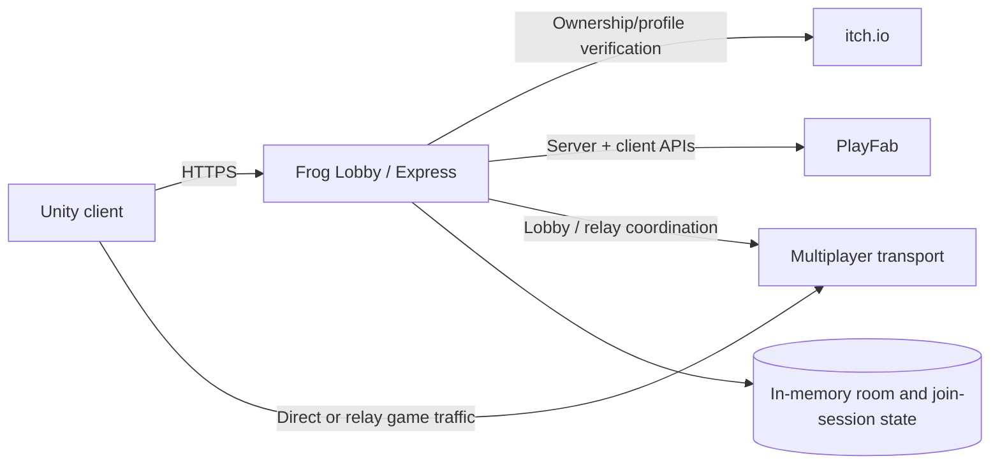

# Frog Lobby

Frog Lobby is the open-source Node.js/Express backend used by **Frog Wars**, a Unity multiplayer game. It handles public lobby discovery, direct/relay connection coordination, ownership-backed sessions, PlayFab-backed player services, and server-authoritative validation for security-sensitive game operations.

The repository is intentionally public so the networking and security design can be reviewed, improved, and reused as a practical reference for small multiplayer game backends.

> **Project status:** Active development. The backend is game-specific and should not be treated as a drop-in authentication or payment library without independent review.

## Why this project exists

Small multiplayer games often need more than a basic room list. They also need to answer questions such as:

- Who is allowed to create or use an official online session?
- How should a Unity client move between direct connectivity and relay networking?
- Which account is authoritative when multiple identity systems are involved?
- How can rewards, inventory, leaderboards, and progression be kept server-authoritative?
- How should replay, duplicate-request, timing, and race-condition abuse be constrained?
- How can security controls remain understandable enough to audit?

Frog Lobby is the backend where those concerns are implemented and tested for Frog Wars.

## Core capabilities

### Multiplayer networking

- Room publication, discovery, heartbeats, and expiry.
- Short-lived join-session state.
- Direct-connect candidate exchange for NAT traversal workflows.
- Relay-aware room metadata.
- Unity Relay and Edgegap-oriented configuration paths.
- Region selection support for relay placement.
- Password-protected room support.

### Authentication and identity

- Server-side itch.io ownership verification.
- RS256-signed Frog Wars session tokens.
- Expiring sessions and remembered-login flows.
- PlayFab session-ticket authentication.
- Binding between Frog Wars sessions and PlayFab identities.
- HMAC-derived server custom IDs for account linking.
- Server-held signing and PlayFab credentials.

### Server-authoritative game services

- PlayFab-backed inventory, currency, statistics, and player data.
- Validated shop purchases and equipment changes.
- Signed shop/profile receipts.
- Tournament reward constraints and duplicate-match protection.
- Arcade run receipts, submission throttling, and score plausibility checks.
- Serialized per-player operations for race-sensitive flows.
- Idempotent/capped reward logic for repeatable gameplay systems.

### Maintenance and testing

The repository uses Node's built-in test runner:

```bash
npm test
```

CI is provided under `.github/workflows/ci.yml`.

## Architecture



The backend is a **trust boundary**. Clients are treated as untrusted for identity, currency, inventory, leaderboard, and reward decisions.

For a deeper description, see:

- [Architecture](docs/ARCHITECTURE.md)
- [Security model](docs/SECURITY_MODEL.md)
- [Security policy](SECURITY.md)
- [Contributing](CONTRIBUTING.md)

## Quick start

### Requirements

- Node.js 20+ recommended.
- npm.
- Optional external services depending on the features you enable:
  - PlayFab
  - itch.io OAuth/API
  - Unity Relay and/or Edgegap

### Install

```bash
git clone https://github.com/giangero1/frog-lobby.git
cd frog-lobby
npm install
```

### Run tests

```bash
npm test
```

### Start the service

```bash
npm start
```

The default port is `7070` unless `PORT` is set.

## Configuration

Secrets must be supplied through environment variables. Do **not** commit private keys, PlayFab secret keys, admin tokens, or development bypass tokens.

Core variables used by the backend include:

| Variable | Purpose |
| --- | --- |
| `PORT` | HTTP listen port. |
| `PLAYFAB_TITLE_ID` | PlayFab title identifier. |
| `PLAYFAB_SECRET_KEY` | Server-side PlayFab secret. |
| `ACCOUNT_LINK_HMAC_SECRET` | HMAC secret used when deriving server custom IDs. |
| `ITCH_GAME_ID` | itch.io game identifier used for ownership checks. |
| `ITCH_OAUTH_CLIENT_ID` | itch.io OAuth client ID. |
| `FROGWARS_SESSION_PRIVATE_KEY` | RSA private key used to sign Frog Wars sessions. |
| `ITCH_OWNERSHIP_ENABLED` | Enables/disables ownership enforcement when configured. |
| `ITCH_DEV_BYPASS_TOKEN` | Development-only bypass secret. Never expose in production clients. |
| `RELAY_PROVIDER` | Selects the configured relay path. |
| `UNITY_RELAY_ENABLED` | Enables the Unity Relay configuration path. |
| `EDGEGAP_LOBBY_URL` | Edgegap lobby/relay service URL when used. |
| `LEGACY_DIRECT_ENABLED` | Enables/disables legacy direct internet rooms. |
| `SHOP_ADMIN_TOKEN` | Protects administrative catalog operations. |

Additional environment variables tune session TTLs, geo/relay selection, arcade validation, tournament rewards, fishing rewards, catalog behavior, and operational timeouts. Read `server.js` and `frogWarsSession.js` before deploying so the deployment matches the intended threat model.

## Security design

Important existing controls include:

- Private-key signing with public-key verification.
- Expiring session tokens.
- Server-side ownership verification.
- Server-side PlayFab authentication.
- Identity consistency checks between submitted IDs, PlayFab tickets, and Frog Wars session claims.
- Constant-time comparison for selected secrets.
- PBKDF2-based room-password hashing.
- Server-side random reward decisions.
- Duplicate-request and duplicate-match handling.
- Per-player serialization around race-sensitive operations.
- Bounds/sanity checks on untrusted values.
- Time-based plausibility checks for arcade scores.
- Expiry and pruning of transient room/session state.

This is an actively evolving security model, not a claim of perfect security. Current hardening priorities are documented in [docs/SECURITY_MODEL.md](docs/SECURITY_MODEL.md).

## Security reports

Please **do not publish exploit details in a normal GitHub issue**.

See [SECURITY.md](SECURITY.md) for the preferred reporting process.

## Contributing

Bug reports, focused security improvements, tests, documentation, and networking/backend improvements are welcome. See [CONTRIBUTING.md](CONTRIBUTING.md).

## License

This project is available under the [MIT License](LICENSE).
