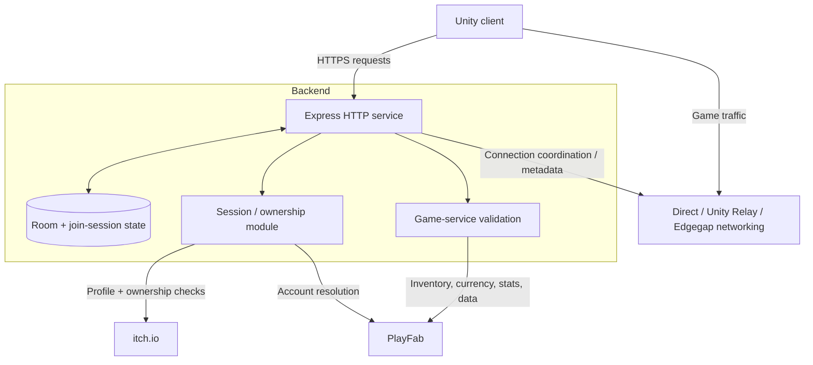

# Architecture

## Overview

Frog Lobby is a Node.js/Express service that coordinates Frog Wars multiplayer discovery and provides server-authoritative access to several account and progression operations.

The main architectural principle is:

> **The game client is not authoritative for identity, ownership, virtual currency, inventory, leaderboard results, or reward eligibility.**

## System context

## Main components

### `server.js`

The primary Express service.

Responsibilities include:

- service/config endpoints;
- room discovery and room lifecycle;
- join-session coordination;
- direct-connect/NAT candidate exchange;
- relay-related configuration;
- PlayFab-backed leaderboards and account state;
- shop/inventory/equipment operations;
- arcade progression and reward validation;
- tournament reward processing;
- fishing reward state;
- transient-state expiry and pruning.

### `frogWarsSession.js`

Authentication/ownership boundary for Frog Wars.

Responsibilities include:

- itch.io profile and ownership verification;
- RSA key loading;
- RS256 token minting and verification;
- short-lived Frog Wars sessions;
- remembered-login token flow;
- development bypass handling;
- middleware-style ownership/session gating.

### PlayFab integration

PlayFab is used as a server-authoritative persistence/account service for operations such as:

- session authentication;
- statistics;
- inventory;
- virtual currency;
- read-only player data;
- catalog-backed purchases.

The backend checks PlayFab session tickets and, for protected flows, verifies that identities agree across request data, the PlayFab ticket, and Frog Wars session claims.

### Room and join-session state

Room state is maintained in memory and pruned using timeouts.

Direct-connect sessions can track:

- client and host connection candidates;
- observed/selected candidates;
- session creation and last-seen times;
- host readiness;
- nomination state.

Relay rooms use relay metadata rather than the same candidate flow.

## Important invariants

### Identity

A caller must not be able to choose another player's PlayFab identity simply by sending a different ID in the request.

### Economy

Currency, inventory, and reward effects must be validated and executed server-side.

### Replay and duplication

Operations that can grant value should be idempotent or otherwise protect against duplicate processing.

### Time

Reward cooldowns and plausibility checks should depend on backend time rather than trusting a client clock.

### Network session lifetime

Transient room/join state should expire and be pruned rather than remain indefinitely reusable.

## Deployment boundaries

The Express service is normally deployed behind an HTTPS-capable platform or reverse proxy. Production operators should explicitly configure trusted proxies, allowed origins, secret storage, rate limiting, and logging appropriate to their environment.

See [SECURITY_MODEL.md](SECURITY_MODEL.md) for a security-focused treatment of these boundaries.
